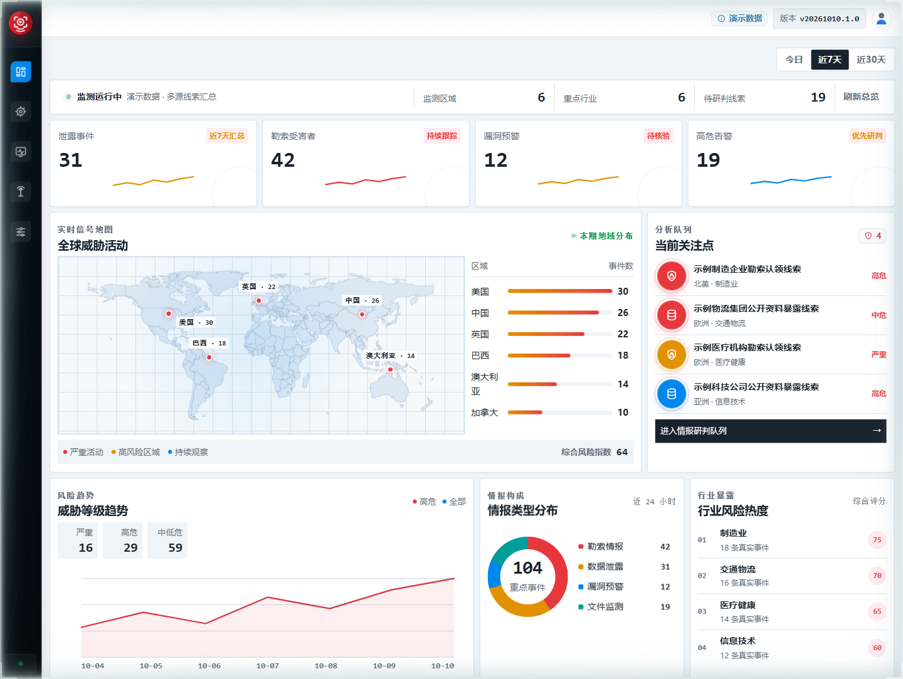
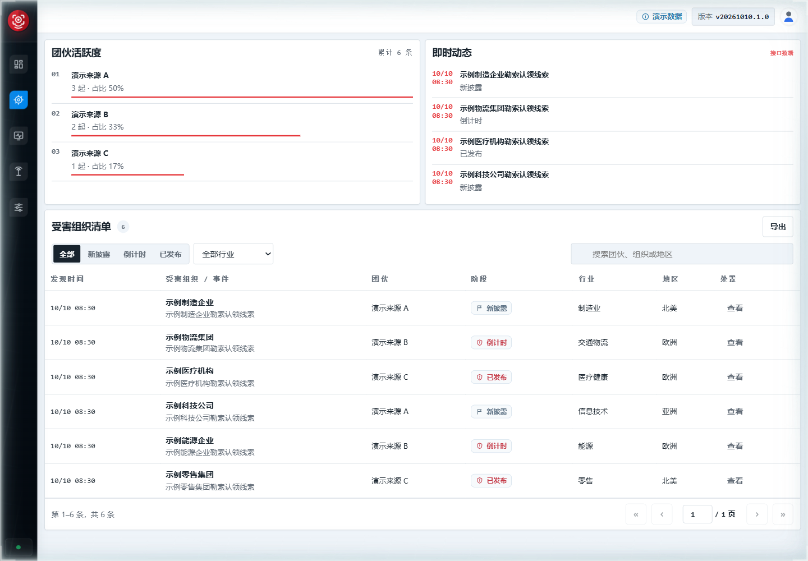
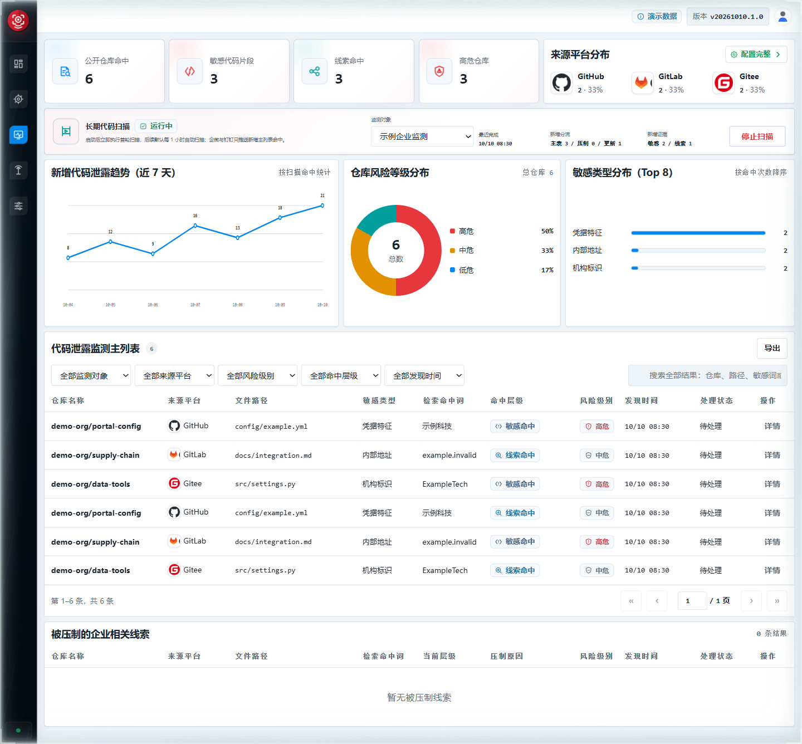
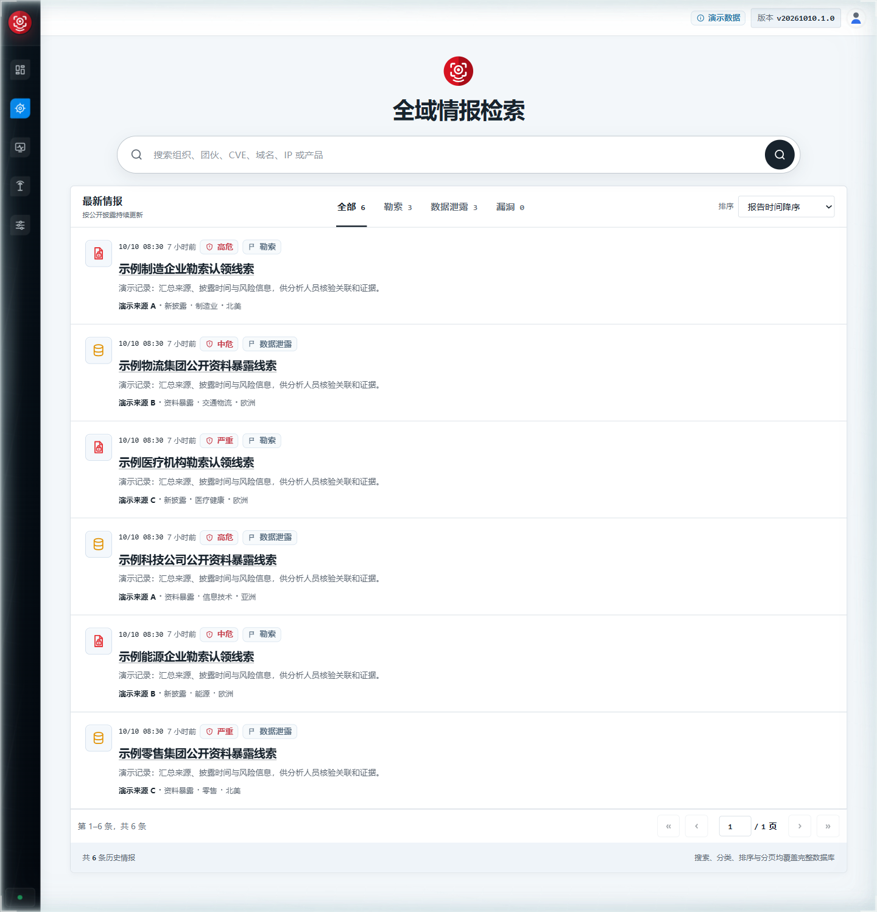
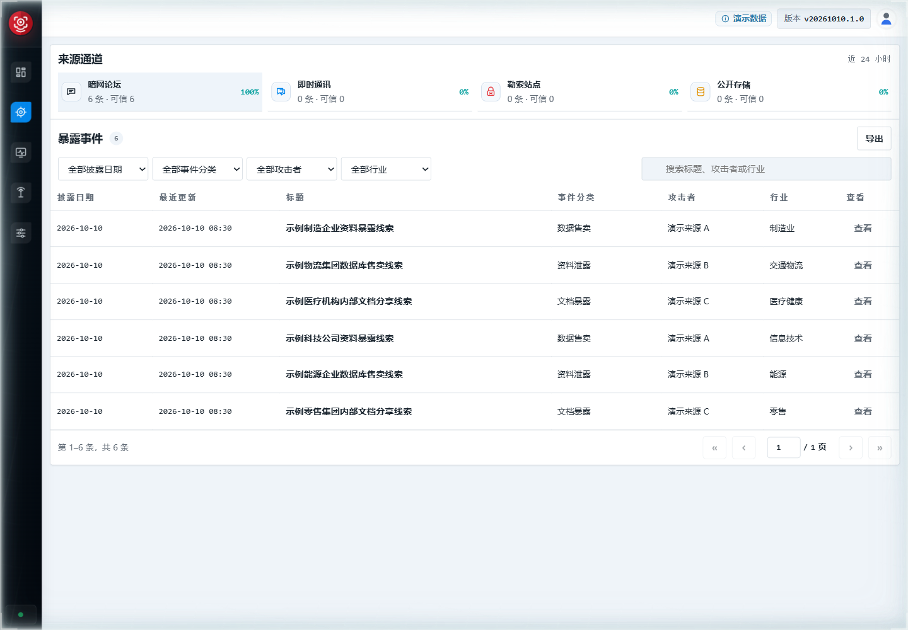
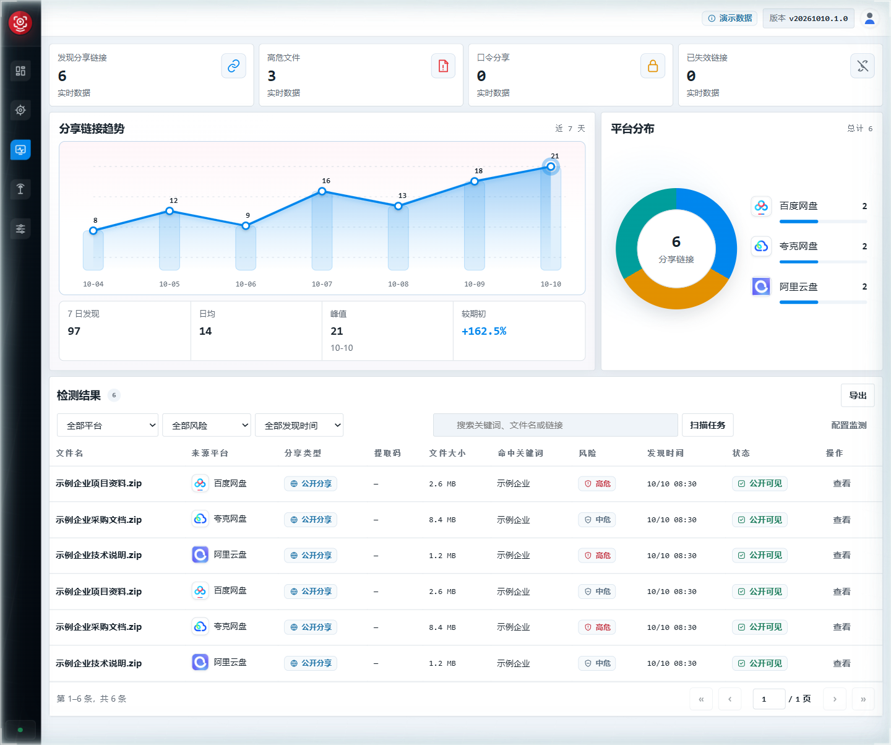
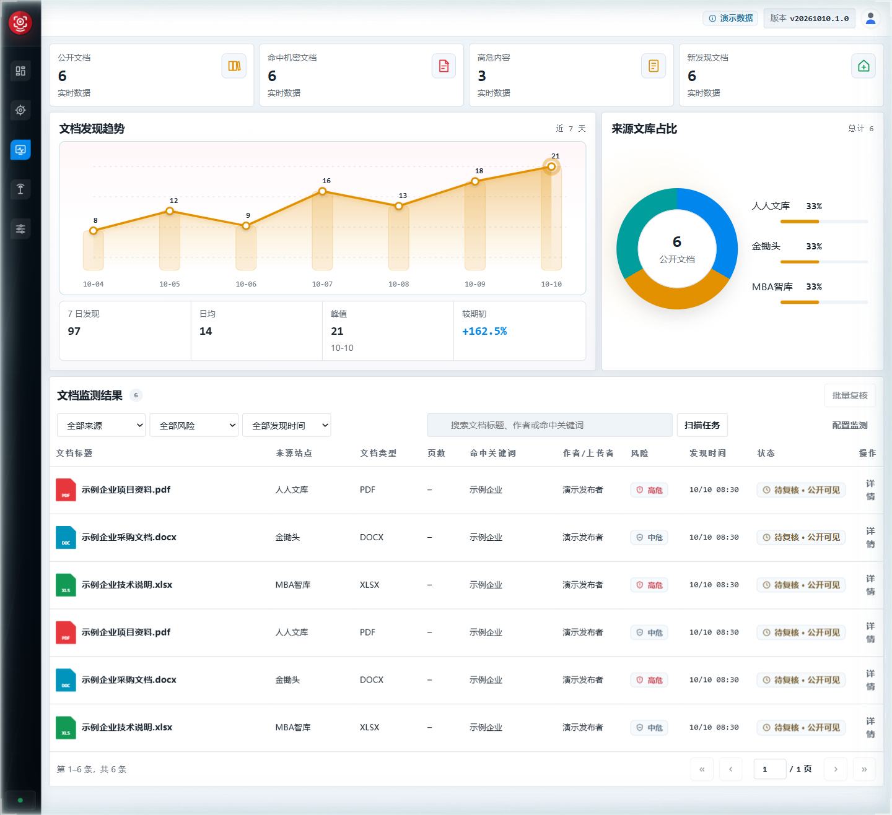
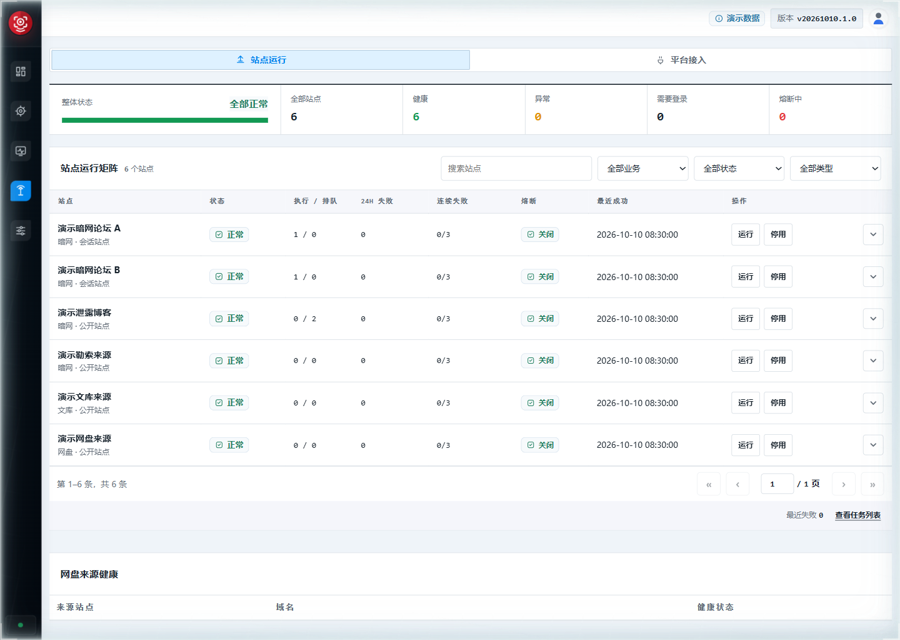
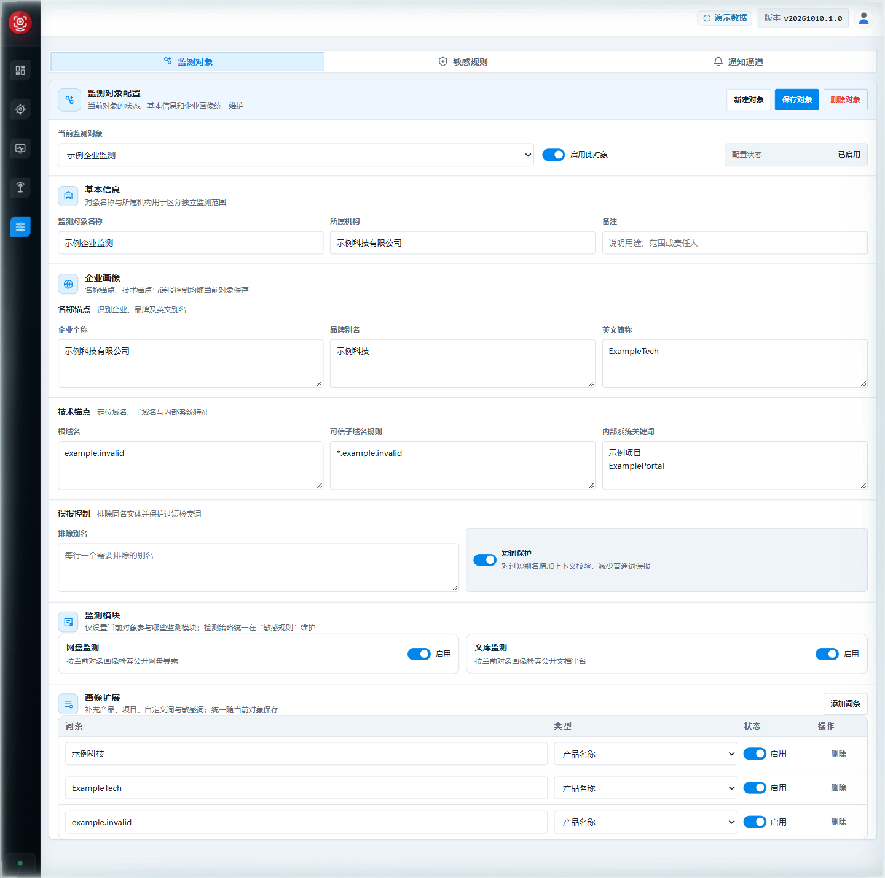

# 玄鉴 · 暗网威胁情报平台

集中监测暗网、勒索、代码及文件暴露线索，支持情报检索、证据核验和企业风险通知。

[下载最新版本](https://github.com/Threat-Intelligence-monitor/Dark-Web-Threat-Intelligence-System/releases/latest) · [安装与运维](docs/USAGE.md) · [反馈问题](https://github.com/Threat-Intelligence-monitor/Dark-Web-Threat-Intelligence-System/issues)

## ✨ 核心功能

| 功能 | 能做什么 |
| --- | --- |
| 暗网与数据泄露监测 | 跟踪论坛及交易站点线索，查看泄露类型、披露时间、来源和原始证据。 |
| 勒索事件跟踪 | 汇总勒索组织认领与受害企业信息，按行业、地区和披露阶段筛选。 |
| 代码泄露监测 | 检索 GitHub、GitLab、Gitee 企业相关代码，识别凭据、密钥、内部地址等风险，支持持续扫描与误报复核。 |
| 文库与网盘监测 | 按企业关键词发现公开文档和分享链接，查看文件清单、访问状态及命中证据。 |
| 统一检索与态势 | 检索勒索、泄露和漏洞情报，查看风险趋势、地域分布与重点事件，导出结果。 |
| 企业监测与通知 | 分企业配置名称、域名、项目词和检测规则，将新增命中推送到企业微信、钉钉。 |
| 采集管理 | 管理来源、登录会话和定时任务，查看运行进度、失败记录及 Tor 网桥状态。 |
| 部署与维护 | Windows 一键启动、在线更新和失败回滚；支持 Linux / WSL 启动、数据迁移及账号权限管理。 |

GitHub 搜索、勒索情报同步及通知通道需配置对应认证。文库、网盘监测覆盖已接入的公开来源，具体配置见[使用说明](docs/USAGE.md)。

## 📸 界面预览

以下为当前界面的演示数据截图。

### 威胁态势总览



### 勒索事件跟踪



### 代码泄露监测



<details>
<summary>查看更多：情报检索、数据泄露、网盘、文库、采集管理、监测配置</summary>

### 情报检索



### 数据泄露监测



### 网盘监测



### 文库监测



### 采集管理



### 企业监测配置



</details>

## 🚀 快速开始

### Windows

1. 从 [Releases](https://github.com/Threat-Intelligence-monitor/Dark-Web-Threat-Intelligence-System/releases/latest) 下载 Windows ZIP 包并解压。
2. 双击 `darkweb.cmd`，按提示选择数据盘，等待依赖安装和服务启动。
3. 打开 [http://localhost:5174](http://localhost:5174)，登录后配置监测对象与来源。

后续仍使用 `darkweb.cmd` 启动；在页面右上角的版本菜单中执行在线更新。

### Linux / WSL

```bash
git clone https://github.com/Threat-Intelligence-monitor/Dark-Web-Threat-Intelligence-System.git
cd Dark-Web-Threat-Intelligence-System
bash darkweb_collector/scripts/start_all_services_wsl.sh start
```

启动后访问 [http://localhost:5174](http://localhost:5174)。

## 📖 更多说明

- [安装、更新与运维](docs/USAGE.md)
- [数据库与镜像迁移](darkweb_collector/DATA_MIGRATION.md)
- [社交平台公开线索监测](darkweb_collector/SOCIAL_MONITORING.md)
- [代码监测误报处理](CODE_MONITORING_FALSE_POSITIVE_PLAYBOOK.md)
- [更新记录](CHANGELOG.md) · [第三方许可](THIRD_PARTY_NOTICES.md)
